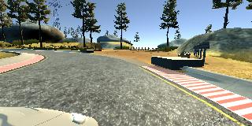
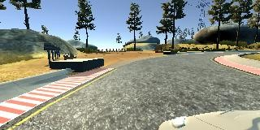

## **Udacity Project: Behavioral Cloning** 
---
#### README

**Behavioral Cloning Project**

The goals / steps of this project are the following:
* Use the simulator to collect data of good driving behavior
* Build, a convolution neural network in Keras that predicts steering angles from images
* Train and validate the model with a training and validation set
* Test that the model successfully drives around track one without leaving the road
* Summarize the results with a written report

#### Rubric Points
Here I will consider the [rubric points](https://review.udacity.com/#!/rubrics/432/view) individually and describe how I addressed each point in my implementation.  

---
#### File Submission (Implementation in Python)

My project includes the following files:

* **model.py** - containing the script to create, train and save the convolutional neural network model  
* **drive.py** - for driving the car in autonomous mode  
* **model.h5** - containing a trained convolution neural network  
* **README.md** - markdown file to summarize the results  
* **DemoSelfDriving_V01_00_03.mp4** - Video to demo the car's self-driving based on the trained model

To train the model with, use command:  ```python model.py```

After training, ```model.h5``` will be created with the model architecture and weights saved inside.  

Based on the Udacity self-driving car simulator, the virtual car can be driven autonomously around the track by Comand:  
```python drive.py model.h5```

---
#### 1. Collection & Augmentation of Driving Data 
  
Human driving data is collected using the Udacity car simulator. This similator allows users to control the virtual car using keyboard and mouse to drive around the simulated track. It saves the road view in each frame captured by the three cameras mounted respectively at the left side, center, and right side of the car, and meanwhile it records the steering angle controlled by keyboard or mouse at the moment when the images are captured.  

Since the steering angle is recorded corresponding to the centre camera's image, compensation of the steering angle need to be applied to the left image and the right image. In this implementation, +0.24 angle is applied to the left image and -0.24 angle for the right image. The left and right images are utilized to train the car to get recovered from the left side and right sides of the road back to center.

Below are examples demonstrating how the captured images look like: 
  
 Steering Angle(Left): -0.3573709  
  
 Steering Angle(Center): -0.1173709  
  
 Steering Angle(Right): +0.1226291  
  
To create a traing dataset, the images captured by the three different cameras are used as training features, while the steering angles are considered as training labels. Besides, in order to further diversify the training data, augmentation on the original dataset is done by flipping the images horizontally and negate the steering angle values accordingly. With this approach, the dataset is doubled.  

Below is an example of image flipping:  
  
 Steering Angle: -0.3573709  
 Steering Angle: +0.3573709  
  
My own dataset generated using mouse control is summarized as below:  
```
    Total Number of Training Data   : 45162
    
    Validation set Split Ratio      : 0.15  
    (85% data for training, while 15% data reserved for validation)

    Number of Training Samples:     38382
    Number of Validation Samples:   6780
```

---

#### 2. Modeling of Convolutional Neural Network

The training model applied in this project, as shown below, is customized from [NVDIA's Convolutional Neural Network Architecture](https://devblogs.nvidia.com/parallelforall/deep-learning-self-driving-cars/). With trial and error, it is found that just by adding three dropout layers before the three fully-connected layers, the training model is able to achive the goal of keeping the self-driving car on Track 1 all the time.
  
Please refer to the table below for the details of Model Architecture: 

```
    ________________________________________________________________
    Layer (type)                 Output Shape              Param #
    =================================================================
    cropping2d_1 (Cropping2D)    (None, 90, 320, 3)        0
    _________________________________________________________________
    lambda_1 (Lambda)            (None, 90, 320, 3)        0
    _________________________________________________________________
    conv2d_1 (Conv2D)            (None, 43, 158, 24)       1824
    _________________________________________________________________
    activation_1 (Activation)    (None, 43, 158, 24)       0
    _________________________________________________________________
    conv2d_2 (Conv2D)            (None, 20, 77, 36)        21636
    _________________________________________________________________
    activation_2 (Activation)    (None, 20, 77, 36)        0
    _________________________________________________________________
    conv2d_3 (Conv2D)            (None, 8, 37, 48)         43248
    _________________________________________________________________
    activation_3 (Activation)    (None, 8, 37, 48)         0
    _________________________________________________________________
    conv2d_4 (Conv2D)            (None, 6, 35, 64)         27712
    _________________________________________________________________
    activation_4 (Activation)    (None, 6, 35, 64)         0
    _________________________________________________________________
    conv2d_5 (Conv2D)            (None, 4, 33, 64)         36928
    _________________________________________________________________
    activation_5 (Activation)    (None, 4, 33, 64)         0
    _________________________________________________________________
    flatten_1 (Flatten)          (None, 8448)              0
    _________________________________________________________________
    dense_1 (Dense)              (None, 100)               844900
    _________________________________________________________________
    activation_6 (Activation)    (None, 100)               0
    _________________________________________________________________
    dropout_1 (Dropout)          (None, 100)               0
    _________________________________________________________________
    dense_2 (Dense)              (None, 50)                5050
    _________________________________________________________________
    activation_7 (Activation)    (None, 50)                0
    _________________________________________________________________
    dropout_2 (Dropout)          (None, 50)                0
    _________________________________________________________________
    dense_3 (Dense)              (None, 10)                510
    _________________________________________________________________
    activation_8 (Activation)    (None, 10)                0
    _________________________________________________________________
    dropout_3 (Dropout)          (None, 10)                0
    _________________________________________________________________
    dense_4 (Dense)              (None, 1)                 11
    =================================================================
    Total params: 981,819
    Trainable params: 981,819
    Non-trainable params: 0
    ______________________________________________________________
```
    
**Avoid Overfitting - Tactic 1: Introducing Dropout Layers**  
As shown in the model architecture above, three dropout layers are added before the three fully-connected layers, respectively, with the drop-out rate set to 50%.  
  
---
#### 3. Training of Convolutional Network Model 

Below is the final configuration of hyper-parameters used in the training:  
```
    Generator Used?  : 1  
    Max Epoch Count  : 8 (keras.callbacks.EarlyStopping() is applied)  
    Batch Size       : 132  
    Generator Size   : 22  
    Optimizer        : Adam Optimizer  
    Learning Rate    : 0.00081  
    Decay Rate       : 0.0  
```

**Optimizer & Learning Rate** - Adam Optimizer is utilized for the model training, so practically the learning rate is not needed to get tuned manually. 

**Avoid Overfitting - Tactic 2: Early Termination**  
To avoid overfitting during training, the tactic of early stopping is applied with Keras callback EarlyStopping(). Specifically, when there have been 2 epoches without any improvement in validation loss, the training process will be terminated. Based on experiments, the general number of epoches until the training process gets stopped by EarlyStopping() is in the range from 5 to 8.
    
The training process with its loss information is recorded as below: 
```
    Epoch 1/8
    292/291 [==============================] - 299s 1s/step - loss: 0.0329 - val_loss: 0.0240
    Epoch 2/8
    292/291 [==============================] - 73s 249ms/step - loss: 0.0255 - val_loss: 0.0171
    Epoch 3/8
    292/291 [==============================] - 73s 250ms/step - loss: 0.0225 - val_loss: 0.0151
    Epoch 4/8
    292/291 [==============================] - 73s 249ms/step - loss: 0.0206 - val_loss: 0.0139
    Epoch 5/8
    292/291 [==============================] - 72s 248ms/step - loss: 0.0192 - val_loss: 0.0123
    Epoch 6/8
    292/291 [==============================] - 72s 247ms/step - loss: 0.0185 - val_loss: 0.0114
    Epoch 7/8
    292/291 [==============================] - 72s 247ms/step - loss: 0.0178 - val_loss: 0.0124
    Epoch 8/8
    292/291 [==============================] - 73s 249ms/step - loss: 0.0167 - val_loss: 0.0108
```

The loss curve is shown as below:  
  


---
#### 4. Demo: Self-Driving with Trained Model 
By starting Udacity's Car Similator and executing the command ```python drive.py model.h5``` at the meantime, the autonomous car will be running, which demonstrates the training result. 

Please refer to the video below as attached -  
(same as **DemoSelfDriving_V01_00_03.mp4** in the project folder)

[](DemoSelfDriving_V01_00_03.mp4)